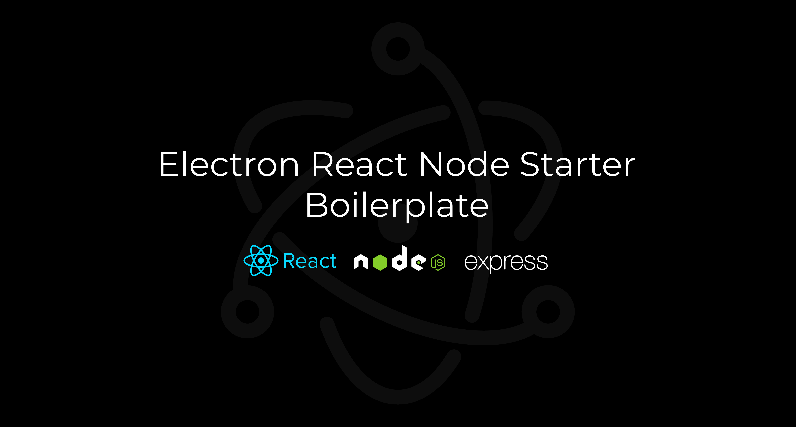

## Electron React Express Boilerplate

## Table of Contents

- [Introduction](#introduction)
- [Features](#features)
- [Build Process](#build-process)
- [Contributors](#contributors)

 

## Introduction

This is a boilerplate code for getting started with electron js with react js and node express server.

## Features

🚀 React & Electron together  
🚀 Run node server in the same time

## Build Process

- Clone or download the repo
- Install dependencies using `npm install` or  `yarn`
- Run app using `npm run start` or  `yarn start`
- Build app (Automatic) `npm run package` or  `yarn package`
- Build app (Manual) `npm run build` or  `yarn build`
- Test the app using `npm run prod` or  `yarn prod`
 

## Contributors

This project is brought to you by these awesome contributors.

    
    
    
  

